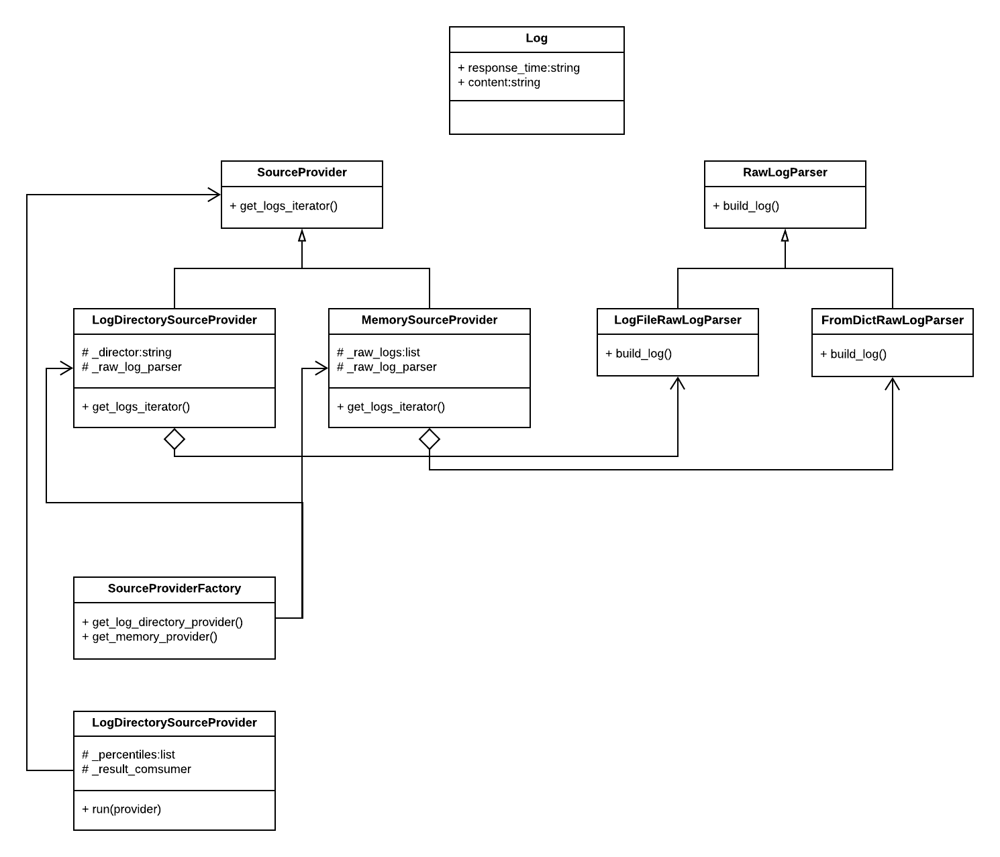

# Riot Test
My answer to the two tests are put in folder LogPercentiles and SystemDesignforDada respectively.
## Test 1: Log Percentiles
UML of my code is as follows:

- RawLogParser: Abstract class who parse raw log and turn it into instance of Log.
  - FromDictRawLogParser: Concrete class derived from RawLogParser. It parse raw log in dictionary.
  - LogFileRawLogParser: Concrete class derived from RawLogParser. It parse raw log in string format.
- SourceProvider: Abstract class to return an iterator of log.
  - MemorySourceProvider: Concrete class derived from SourceProvider. It return logs from memory.
  - LogDirectorySourceProvider: Concrete class derived from SourceProvider. It return logs from directory.
- SourceProviderFactory: A factory to produce SourceProvider.
- LogPercentileCalculator: A facade class calculate the percentiles.

## Test 2: System Design for Dada
Please refer to file SystemDesignforDada.docx.